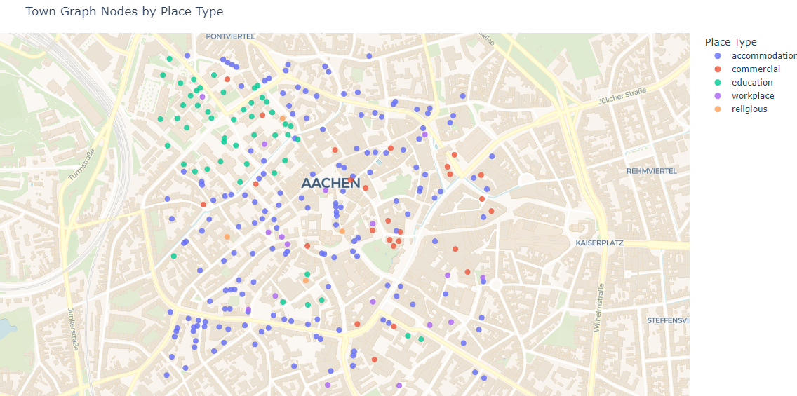
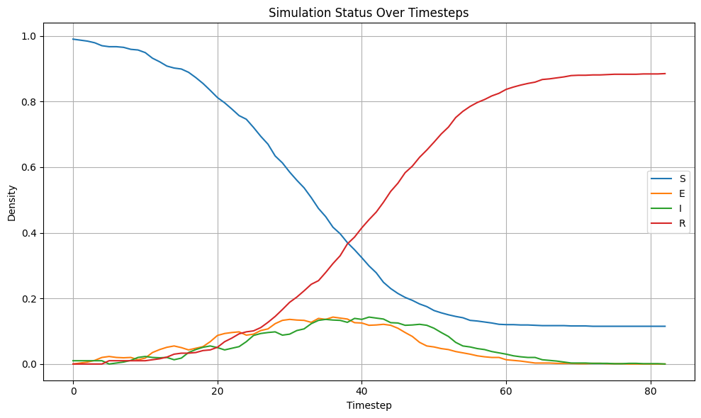
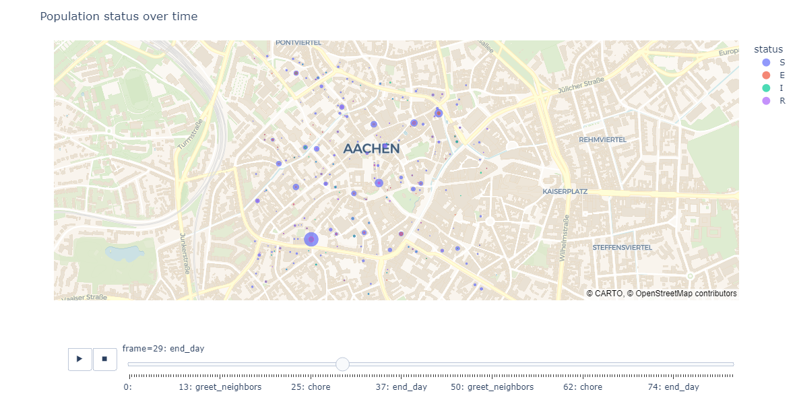
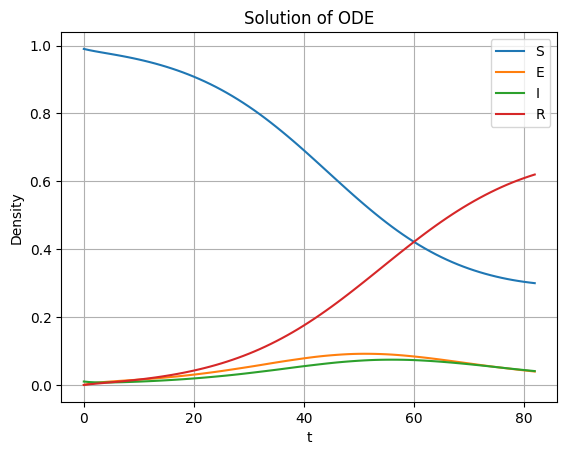

Getting Started with simcronomicon
==================================

Welcome to **simcronomicon**! This guide will help you get started with the main features of the package, including building a town, defining disease spread models, running simulations, and visualizing results.

We will use the simplest and most common infection model in disease modeling throughout this tutorial, the SEIR model!

**If you have no knowledge on disease modeling, we recommend you to visit the tutorial in examples/basic_disease_spread.ipynb
so that you might have a better grasp of how epidemic agent-based modelling looks like in action.**

Installation
------------

We recommend using conda to install simcronomicon and its dependencies:

.. code-block:: bash

   # Clone the repository (if you haven't already)
   git clone https://github.com/warisa-r/simcronomicon.git
   cd simcronomicon

   # Create and activate the conda environment
   conda env create -f environment.yml
   conda activate simcronomicon-env

   pip install .

   # Verify the installation
   python -c "import simcronomicon; print(simcronomicon.__version__)"

Basic Workflow
--------------

1. **Create or load a town network**
2. **Define step events and a infection model**
3. **Run a simulation**
4. **Visualize the results**

Building or Loading a Town
--------------------------

First step of running the simulation of agent-based network modeling is generating a network from a given
geographic point you want to simulate your spread on.

You can simply call the function `from_point` from the module `Town`
to generate the appropriate input files.

When a `Town` object is generated, a network of buildings is created with each node carrying the x and y coordinate of the building
centroids in your interested location connected with each other with edges that represent shortest path distances from each other.
Furthermore, each node that represent each location in town is also classfied to different types of buildings with the building tags
in OpenStreetMap data.

**Create from a geographic point:**

.. code-block:: python
    
    from simcronomicon import Simulation, Town, TownParameters

    from simcronomicon.infection_models import (
        SEIRModel, SEIRModelParameters, FolkSEIR,
        StepEvent, EventType,
    )

    from simcronomicon.visualization import (
        plot_status_summary_from_hdf5,
        plot_place_types_scatter,
        plot_agents_scatter
    )

    from simcronomicon.infection_models import (
        log_normal_mobility,
    )

    town = Town.from_point(
        point=[50.7753, 6.0839],  # Aachen Dom
        dist=1000,
        town_params=town_params,
        file_prefix="aachen_dom",
        save_dir="./data"
    )

A simple town graph in `.graphmlz` form and its configuration file in `.json` form is then generated. These are important input files
for the simulation and visualization later on!

Since constructing a `Town` object can take a while (see the documentation in Town modules as to why), we also provide you an
option to create the input files and load them to use in other simulations later.

Note that we have not talked about `town_params`. `town_params` can be defined with the following code:

.. code-block:: python

    town_params = TownParameters(num_pop=1000, num_init_spreader=3, spreader_initial_nodes = [1, 2, 2])

With these parameters, you get 997 agents that are susceptible to the spread and 3 that are infectious.
2 of the infectious agents are placed at node of ID 2 in the to-be-constructed graph. The other one is located at node 1.
If `spreader_initial_nodes` are not defined at all or not defined for all spreaders, the spreader will be placed randomly
at a node in the town_graph.

Even though `town_params` is a part of the `Town` object 
(define geographical initial condition of the simulation), it indeed is seperated from the construction of the 2 input files
with the function `from_point`. This means that you can generate a town graph with one set of `town_params` and the town object with
your desired initial condition and 2 output files that are independent of your current initial condition. This is so that you can reuse
the input files with different initial conditions. You can do so by the function `from_files` in our `Town` module.

**Load from files:**

.. code-block:: python

   import simcronomicon as scon

   town_params = TownParameters(num_pop=1000, num_init_spreader=10)
   town_graph_path = "../test/test_data/aachen_dom_500m.graphmlz"
   town_config_path = "../test/test_data/aachen_dom_500m_config.json"
   town = Town.from_files(
       config_path=town_config_path,
       town_graph_path=town_graph_path,
       town_params=town_params
   )

---

Visualizing the Town
--------------------

By calling the function `plot_place_types_scatter`, you can see the classification of `place_types` of the location you are interested in.
It is very important to note that unclassified nodes or the grey nodes that are tagged `other` will not be processed in the simulation.

.. code-block:: python

   plot_place_types_scatter(town_graph_path, town_config_path)

*The visualization shows different place types in the interested area with different colors*

Defining Step Events and a Model
--------------------------------

Step events control agent movement and interactions. You can use defaults or define your own.
Here, we define such that people in our simulation always go out and greet their neighbors and go to work
afterwards. In these event steps, if the agents have enough energy, they will go to the destined location with our specified `place_types`.

.. code-block:: python

   step_events = [
       StepEvent(
           "greet_neighbors",
           FolkSEIR.interact,
           EventType.DISPERSE,
           5000,
           ['accommodation']),
       StepEvent(
           "chore",
           FolkSEIR.interact,
           EventType.DISPERSE,
           19000,
           [
               'commercial',
               'workplace',
               'education',
               'religious'
           ],
           log_normal_mobility
       )
   ]

Then,  they will `interact` with their environments and other agents in the same
location node. These interactions are what trigger the spread!

Here is the codeblock of the interaction function in `FolkSEIR` for you to see that an agent can contract a disease
exactly through attending these events. (And their energy also decreases!)

.. code-block:: python

    def interact(
                self,
                folks_here,
                current_place_type,
                status_dict_t,
                model_params,
                dice):
            # When a susceptible person comes into contact with an infectious person,
            # they have a likelihood to become exposed to the disease
            if self.status == 'S' and self.inverse_bernoulli(
                    folks_here, model_params.beta, ['I']) > dice:
                self.convert('E', status_dict_t)

            self.energy -= 1

After these events are done, all the agents will go to sleep. This is the end of 1 simulation time step.
Note that some status transitions that are time-sensitive are triggered when `sleep` is activated.
Here is how the sleep function looks like for SEIR model so that you can see that an agent will transition
from being 'E' or exposed to 'I' or infectious if an amount of incubation time has passed.

.. code-block:: python

    def sleep(
            self,
            folks_here,
            current_place_type,
            status_dict_t,
            model_params,
            dice):
        super().sleep()
        if self.status == 'E' and self.status_step_streak == model_params.sigma:
            self.convert('I', status_dict_t)

After defining what an agent will go through in each day, you have to also define the way the disease "work".
This is through defining proper model parameters. Here, `beta` governs how contagious the disease is,
`sigma` is the incubation period, and `gamma` is the time one needs to recover from being infectious to immune.

.. code-block:: python

   model_params = SEIRModelParameters(
       max_energy=5, beta=0.4, sigma=6, gamma=5, xi=200)
   model = SEIRModel(model_params, step_events)

---

Running a Simulation
--------------------

This step is pretty straightforward. After the town, model, and all their parameters have been defined, we run the simulation
with the desired maximum time steps. Note that the simulation always terminates automatically when there exists no more spread carrier
in it anymore.

.. code-block:: python

   sim = Simulation(town, model, 100)
   sim.run()

After the simulation finish running, an output file `simulation_output.h5` will be generated in the following structure:

.. code-block:: text

            simulation_output.h5
            ├── metadata
            │   ├── simulation_metadata   (JSON-encoded simulation metadata)
            │   └── town_metadata         (JSON-encoded town metadata)
            ├── status_summary
            │   └── summary               (dataset: structured array with timestep, current_event, and statuses)
            └── individual_logs
                └── log                   (dataset: structured array with timestep, event, folk_id, status, address)

Visualizing Simulation Results
------------------------------

For visualization, we provide 2 functions to see how your spread develops.

1. Plot the compartment status summary:

.. code-block:: python

   plot_status_summary_from_hdf5("simulation_output.h5")

*Figure: Status density plot of ABM simulation throughout all simulation time steps*

2. Visualize agent locations on the map:

.. code-block:: python

   plot_agents_scatter("simulation_output.h5", town_graph_path)

*Figure: Scatter plot of agents with each status in different location at day 29 in the simulation*

Comparing with ODE Solution (SEIR Example)
------------------------------------------

You can compare your simulation to a standard ODE solution by using `scipy.integrate`. Here is an ODE system of 
the SEIR infection model that also governs the agent interaction and contagion dynamic in our ABM simulation:

.. code-block:: python

   import numpy as np
   from scipy.integrate import solve_ivp
   import matplotlib.pyplot as plt

   def rhs_func(t, y):
       S, E, I, R = y
       N = S + E + I + R
       rhs = np.zeros(4)
       rhs[0] = -model_params.beta * S * I / N + 1/model_params.xi * R
       rhs[1] = model_params.beta * S * I / N - 1 / model_params.sigma * E
       rhs[2] = 1/model_params.sigma * E - 1/model_params.gamma * I
       rhs[3] = 1/model_params.gamma * I - 1/model_params.xi * R
       return rhs

   t_end = 82
   t_span = (0, t_end)
   y0 = [0.99, 0, 0.01, 0]  # 1000 pop, 10 infected, 990 susceptible
   t_eval = np.arange(0, t_end + 1)

   sol = solve_ivp(
       rhs_func,
       t_span,
       y0,
       method='RK45',
       t_eval=t_eval
   )

   plt.plot(sol.t, sol.y[0], label='S')
   plt.plot(sol.t, sol.y[1], label='E')
   plt.plot(sol.t, sol.y[2], label='I')
   plt.plot(sol.t, sol.y[3], label='R')
   plt.xlabel('t')
   plt.ylabel('Density')
   plt.title('Solution of ODE')
   plt.grid()
   plt.legend()
   plt.show()

This is the result of the plot produced by solving this ODE system. You can see that agent-based modelling produced the same kind of
pattern emergence as the ODE system predict with some randomness included.

*Figure: Result of ODE-based SEIR simulation*

Next Steps
----------

- Explore other models: SEIsIrR, SEIQRDV, or define your own by subclassing `AbstractInfectionModel`.
- Customize step events for your scenario.
- See the API documentation for advanced usage.

For more details, see the full documentation and examples in the `examples/` folder.